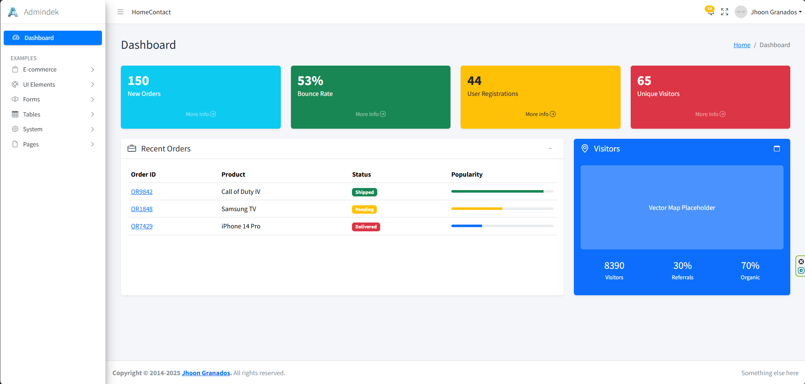

# Admindek - Admin Panel Template



**Admindek** is a premium, high-quality, and modern Admin Dashboard Template built on top of **Bootstrap 5**. It offers a clean, professional, and fully responsive design that works seamlessly on all major web browsers and devices.

This template is perfect for building various web applications, such as admin dashboards, project management systems, admin panels for web apps, backends for e-commerce, and more. It is designed with developer experience in mind, ensuring easy customization and integration.

Developed with ❤️ by **Jhoon Granados**.

---

## 🚀 Features

- **Built with Bootstrap 5**: Utilizing the latest features of the world's most popular CSS framework.
- **Fully Responsive**: Optimized for desktops, tablets, and mobile devices.
- **Zero Dependencies (jQuery-FreeCore)**: Core layout written in pure Vanilla JavaScript. *(Note: jQuery is used only for DataTables integration)*.
- **SPA-Like Navigation**: Includes a lightweight custom script (`assets/js/custom.js`) for smooth, page-refresh-free navigation.
- **New Modules**:
  - **DataTables**: Advanced tables with sorting, searching, and pagination.
  - **Advanced Forms**: Integrated **TomSelect** for powerful dropdowns and tagging.
  - **File Uploads & Inputs**: Styled form controls.
- **Rich UI Components**: Pre-styled cards, buttons, tables, alerts, and forms.
- **Advanced Sidebar**: Collapsible sidebar with nested menus and smooth transitions.
- **4 Unique Authentication Designs**: Login & Register pages in 4 distinct styles.
- **Integrated Plugins**:
  - **Bootstrap Icons**
  - **SweetAlert2**
  - **TomSelect**
  - **DataTables** (jQuery)
- **Google Fonts**: Uses *Public Sans*, *Montserrat*, and *Inter*.

## 📂 Folder Structure

```
template-admin-panel/
├── assets/
│   ├── css/            # Bootstrap & Custom Styles
│   ├── img/            # Images & Logos
│   └── js/             # Bootstrap, Custom Logic, Plugins
├── pages/
│   ├── advanced-elements.html  # TomSelect & Advanced Forms
│   ├── general-elements.html   # Basic Inputs
│   ├── datatables.html         # DataTables Integration
│   ├── simple-tables.html      # Bootstrap Tables
│   ├── buttons-alerts.html     # UI Elements
│   ├── orders.html             # E-commerce
│   ├── products.html           # E-commerce
│   ├── users.html              # User Management
│   ├── settings.html           # Settings
│   └── ... (Auth pages)
└── index.html                  # Main Dashboard
```

## 🛠️ Getting Started

### Prerequisites

You only need a modern web browser to run this template. For development, a local server (like VS Code Live Server) is recommended to ensure AJAX navigation works correctly.

### Installation

1. **Clone the repository:**
   ```bash
   git clone https://github.com/JhoonGranados/Admindek.git
   ```

2. **Navigate to the project directory:**
   ```bash
   cd Admindek
   ```

3. **Open `index.html`** in your browser.

## 💻 Development Guide

### How to Create a New Page

1. **Duplicate** an existing page (e.g., `pages/blank.html` or `pages/users.html`).
2. **Update** the page content inside the `.admin-content` container.
3. **Register** the new page in `index.html` and other sidebar menus:
   - Add a list item `<li>` with an `<a>` tag pointing to your new file.
4. **Test** the navigation. The `custom.js` script automatically handles the loading.

### Customizing Styles

Modify `assets/css/custom.css`. Use the CSS variables at the top of the file to quickly change the color scheme:

```css
:root {
    --primary-color: #0d6efd;
    --sidebar-bg: #fff;
    /* ... */
}
```

## 🤝 Contributing

Contributions are welcome! This project is open-source and we want to make it better together.

1. **Fork** the project on GitHub.
2. **Create** your feature branch (`git checkout -b feature/AmazingFeature`).
3. **Commit** your changes (`git commit -m 'Add some AmazingFeature'`).
4. **Push** to the branch (`git push origin feature/AmazingFeature`).
5. **Open** a Pull Request.

## 📄 License

This project is open-source and available under the **MIT License**.

```text
MIT License

Copyright (c) 2026 Jhoon Granados

Permission is hereby granted, free of charge, to any person obtaining a copy
of this software and associated documentation files (the "Software"), to deal
in the Software without restriction, including without limitation the rights
to use, copy, modify, merge, publish, distribute, sublicense, and/or sell
copies of the Software, and to permit persons to whom the Software is
furnished to do so, subject to the following conditions:

The above copyright notice and this permission notice shall be included in all
copies or substantial portions of the Software.

THE SOFTWARE IS PROVIDED "AS IS", WITHOUT WARRANTY OF ANY KIND, EXPRESS OR
IMPLIED, INCLUDING BUT NOT LIMITED TO THE WARRANTIES OF MERCHANTABILITY,
FITNESS FOR A PARTICULAR PURPOSE AND NONINFRINGEMENT. IN NO EVENT SHALL THE
AUTHORS OR COPYRIGHT HOLDERS BE LIABLE FOR ANY CLAIM, DAMAGES OR OTHER
LIABILITY, WHETHER IN AN ACTION OF CONTRACT, TORT OR OTHERWISE, ARISING FROM,
OUT OF OR IN CONNECTION WITH THE SOFTWARE OR THE USE OR OTHER DEALINGS IN THE
SOFTWARE.
```

## 👤 Author

**Jhoon Granados**

- Github: [@JhoonGranados](https://github.com/JhoonGranados)
- Portfolio: [Codigolite](https://codigolite.com)

---
*If you find this project useful, please give it a ⭐️ on GitHub!*
